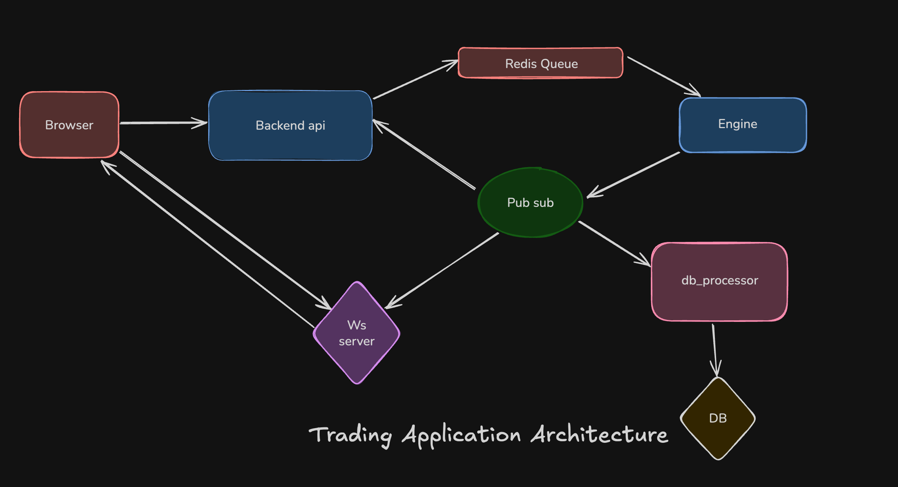

# Centralised exchange

I happen to learn some Finance terms before building this, here are some

- Limit Order - Buy/sell an asset at a particular price, the trade might not execute immediately.
- Market Order - Buy/sell an asset at the best available price, trade will happen immediately.
- Order Book - List of all buy and sell orders, sorted by price. 
- Liquidity - How easily an asset can be bought/sold. More liquid an exchange is, the better is the exchange 
- Spread - Difference between the highest buy price and lowest sell price, lesser the spread, more the liquidity.
- Maker / Market maker - someone who adds liquidity, by adding orders on both sides, in order for trades to be executed smoothly, companies like Citadel provides these making, in return they get better prices, lesser trading fees etc. 
- Slippage - Difference between expected price and the actual price, may arise due to latency, or other reasons. We can put an upper cap.
- Leverage - Borrowing money to trade bigger positions, higher the leverage, your position in the asset becomes higher
- Margin - The amount we put against getting leverage, once the margin we put is exhausted, our leveraged position is closed.
- Arbitrage - Buying low on one market, selling high on another for profit.
- Limit price - Even while making a market order, an upper cap to the price of asset is automatically put in order to get the asset at a fair price. This is also known as quote of the order. 
- Price of an asset - is the price at which the last trade of that asset happened.
- Depth - shows quantity of orders (both buy and sell) available at a particular time
- Ticker - just a snapshot of the market at a particular instance of time

## Project Architecture

## About

Centralised exchanges are fascinating. This repo is my naive attempt, to mimic the architecture of a trading exchange. I am using a distributed
system approach, to keep things peristant, scalable and fast. 

A primary metric in these systems is the trade execution time. I was able to achieve sub 10ms latency running my app locally, which is considered good.

### Components Breakdown

- **Backend API (TypeScript)**  
  → Entry point for all client actions.  
  → Forwards trade/order requests to Redis Queue and handles responses through Pub/Sub.

- **Redis Queue**  
  → Message queue ensuring asynchronous, high-throughput communication between backend and engine.

- **Engine**  
  → Core trading logic lives here.  
  → Maintains in-memory **order books**, and user balances,  matches buy/sell orders, and publishes trade events.

- **Pub/Sub System (Redis)**  
  → Facilitates real-time communication between backend, engine, WebSocket server, and database processor.

- **WebSocket Server**  
  → Streams live tickers, trades, and order book updates directly to browsers.

- **DB Processor**  
  → Listens to trade events via Pub/Sub and updates the database asynchronously.

- **Database (Postgres)**  
  → Persistent store for trades.

- Docker 
 -> For running the entire app, run `docker compose up --build`
---
